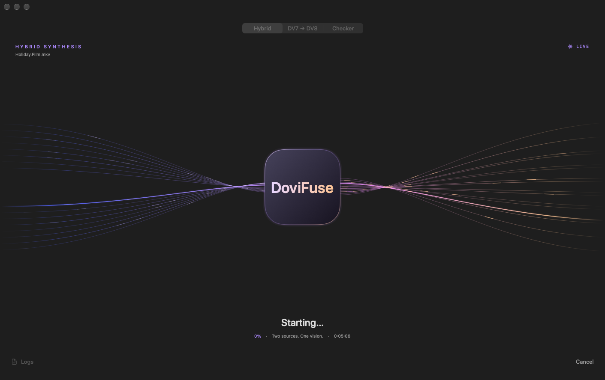

# DoviFuse

Convert, combine, and check Dolby Vision MKV files with a native macOS app
and a Rust command-line engine.



## What it does

- **Convert:** turn Dolby Vision Profile 7 files into Profile 8.
- **Combine:** pair metadata from a compatible Profile 7 or 8.1 source with an
  HDR10 video to create a hybrid.
- **Check and repair:** inspect a file's video and metadata, review the report,
  and correct supported synchronization offsets.

## Download

Get `DoviFuse-arm64.dmg` from [Releases](https://github.com/MelvinSDRS/DoviFuse/releases).
Open it and drag **DoviFuse** into Applications.

The app runs on **Apple Silicon Macs** and includes its media tools. It is
ad-hoc signed, so macOS may require approval in **System Settings → Privacy &
Security** on first launch. Releases include checksums and source archives.

## Using the app

1. Choose **Hybrid**, **DV7 → DV8**, or **Checker**.
2. Add your input files and choose a scratch folder with enough free space.
3. Run the operation and review its saved report.

**Use copies of your media.** Standard conversion replaces the original after
validation. Hybrid conversion keeps both sources, and sync repair writes a new
file. Profile 7 FEL conversion does not preserve enhancement-layer
reconstruction. Profile 5 inputs are not supported.

## Command line

```bash
# Convert a Profile 7 file
./DoviFuse.sh movie.mkv

# Build a hybrid from two sources
./DoviFuse.sh --hybrid donor.mkv hdr10.mkv

# Check a file without changing it
./DoviFuse.sh --check movie.mkv
```

See the [CLI reference](docs/CLI.md) for installation requirements, all options,
qBittorrent automation, and report details.

## Development

- [`dovifuse_converter/`](dovifuse_converter/) — Rust engine.
- [`macapp/`](macapp/) — SwiftUI app and macOS packaging.
- [`scripts/`](scripts/) — regression tests and release tooling.

Linux and macOS build and regression checks run in GitHub Actions. Successful
`main` builds publish downloads automatically. See the
[macOS build guide](macapp/README.md) for packaging and release verification.

## Built with

[dovi_tool](https://github.com/quietvoid/dovi_tool) ·
[FFmpeg](https://ffmpeg.org/) ·
[MKVToolNix](https://mkvtoolnix.download/) ·
[MediaInfo](https://mediaarea.net/MediaInfo)

## License

Original source code and documentation: [MIT](LICENSE). Third-party tools retain
their own licenses. App icons and other artwork are outside this source-code
license grant unless separately stated.
